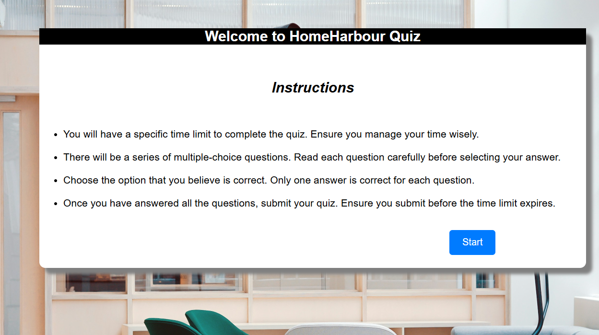
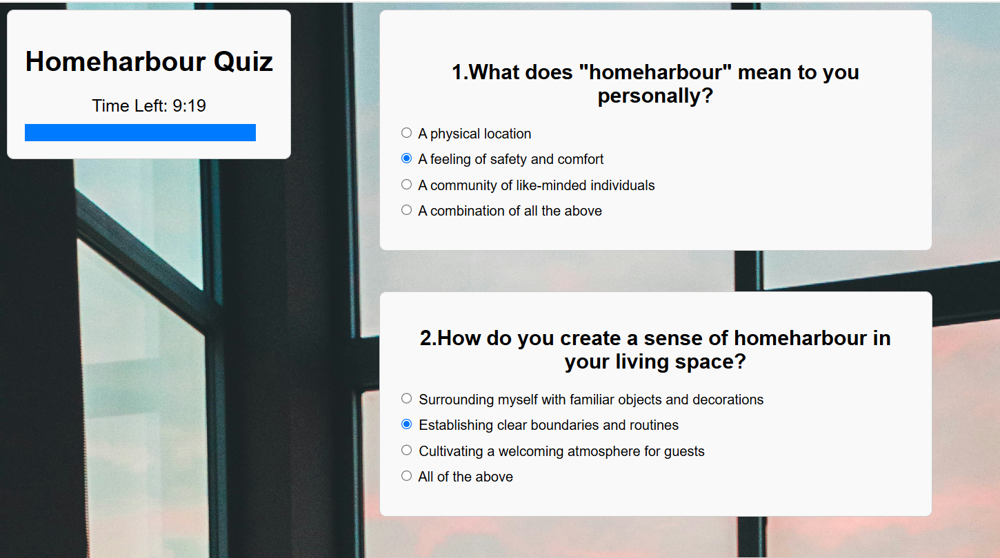
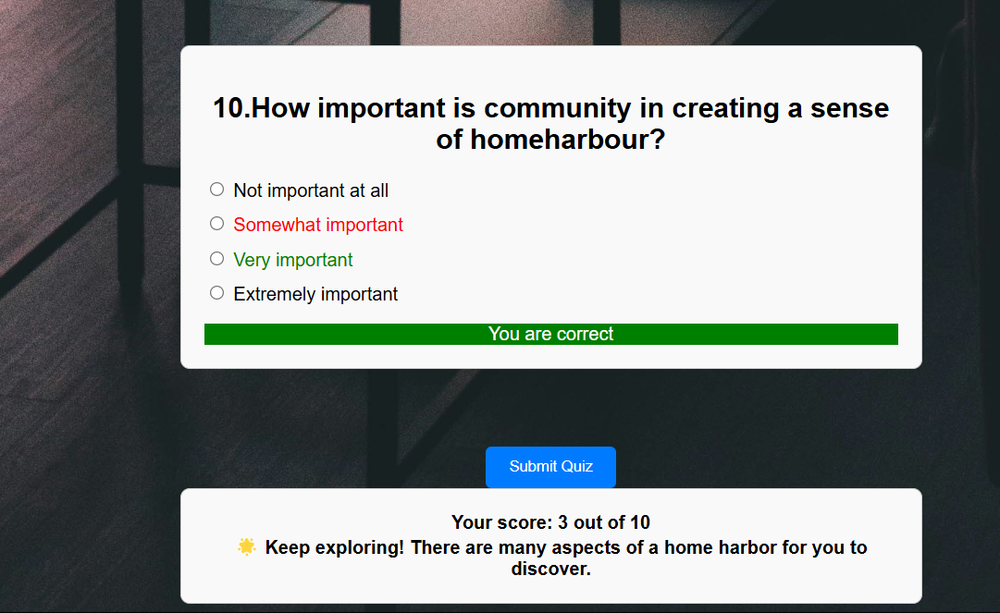

# 🎯 Quiz App

A simple and responsive quiz application built using HTML, CSS, and JavaScript. The app displays a set of multiple-choice questions, tracks the user's answers with an time tracker, and displays the score at the end.

## 🚀 Features

- Multiple-choice quiz questions
- Real-time score tracking
- Dynamic content rendered using JavaScript

## 🛠️ Technologies Used

- HTML5
- CSS3
- JavaScript

## 📸 Screenshots

### 🏠 Instruction Screen
Shows the quiz title , instructions and start button.  

---

### ❓ Quiz Question Screen
Displays a question with multiple answer choices.  

---

### ✅ Result Screen
Displays your score after finishing the quiz.  

